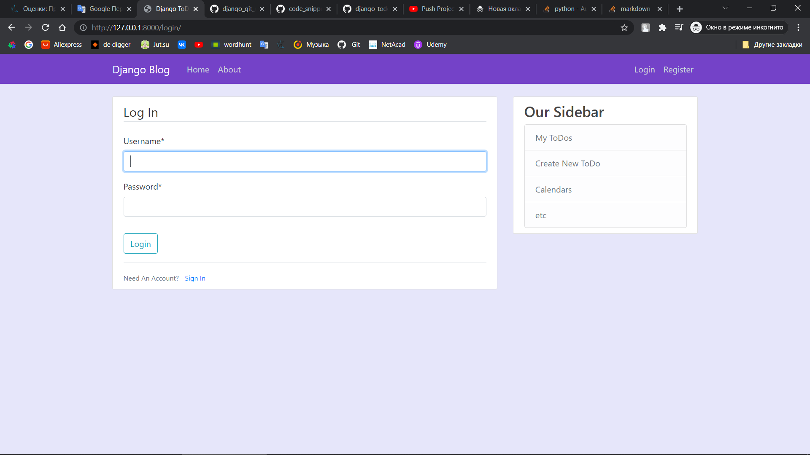
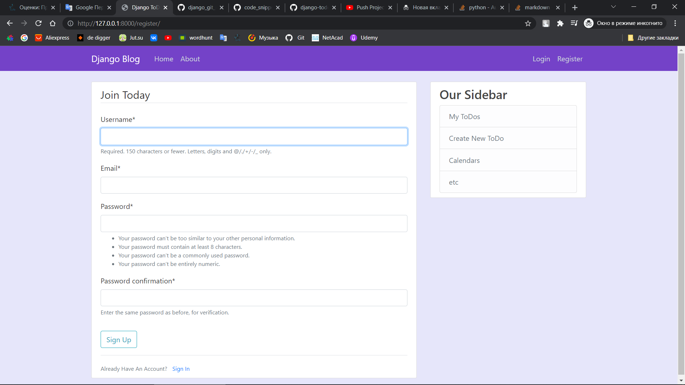
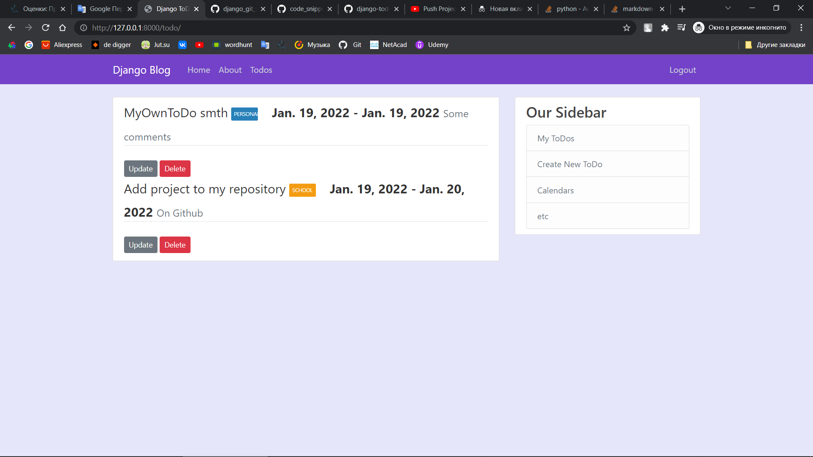
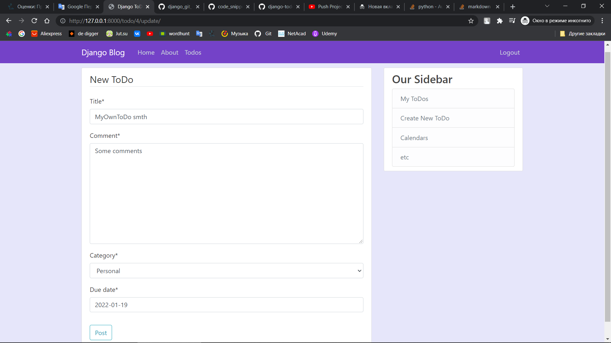
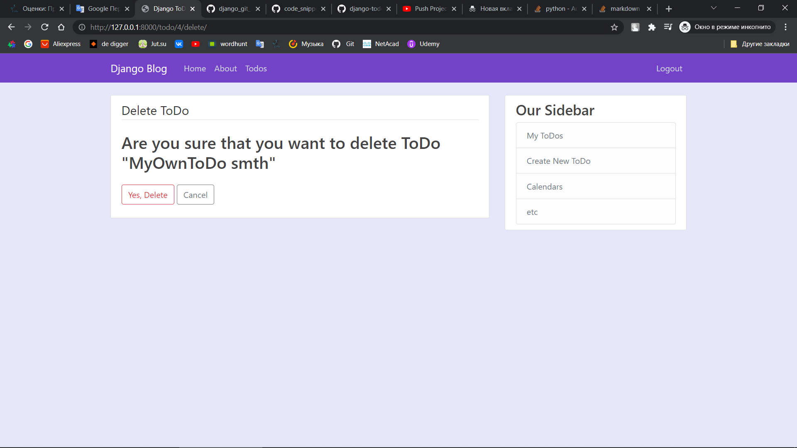

# python-django-todoapp


## Title
ToDo  app using Django Webframework and Postgresql.

### Table of Contents
- [Installation](#installation)
- [Usage](#usage)
- [Examples](#examples)
- [License](#lisense)

---

## Installation

* ### Django
```python $ pip install django```

* ### psycopg2
```python $ pip install psycopg2```

* ### PostgreSQL Database [Download](https://www.enterprisedb.com/downloads/postgres-postgresql-downloads)

* ### To run the server
```python $ cd django_project```
```python $ python manage.py runserver```


## Usage
After installing needed modules, just execute app.py, it will start server.

By Default it will start on : http://127.0.0.1:8000/


## Examples

 So, with this website User can register, login;
 
 
 User can see, create, update, delete Todos; 





